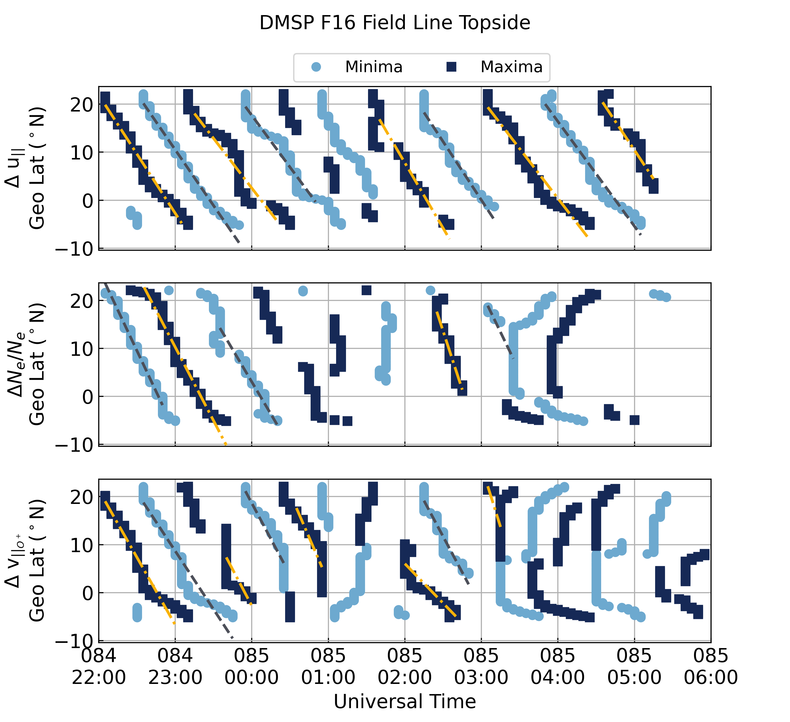

.. _ex-plot-peak:

Identify and Plot the TID Maxima and Minima
===========================================

This example recreates Figure 13 from the manuscript this repository supports.
It uses the model run loaded in :ref:`ex-load`

::
   import datetime as dt
   import numpy as np
   import lstid_processing.model as lsmod

   # Define the plot time range
   estart = dt.datetime(2014, 3, 25, 22)
   estop = dt.datetime(2014, 3, 26, 6)

   nt_start = lsmod.analysis.get_time_index(sami['datetime'].values, estart)
   nt_stop = lsmod.analysis.get_time_index(sami['datetime'].values, estop) + 1

   # Get the field-line indices
   (nlind, nfindc, nfindd, nt, nzindc,
    nzindd) = lsmod.analysis.get_default_indices(sami['datetime'].values,
                                                 sami['glat'].values)

   # Find the F2 peak locations for this period
   f2_inds = lsmod.analysis.get_f2_peaks(nlind, nfindd, sami)

   # Define the topside as the altitude range between the highest F2 peaks
   nzinds = np.arange(f2_inds['south'][nt_start:nt_stop].min(),
                      f2_inds['north'][nt_start:nt_stop].max() + 1, 1)

   # Create the plot and get the analysis data
   out = lsmod.plots.get_plot_tid_peaks(sami, nt_start, nt_stop, nlind, nfindd,
                                        nzinds, 'd', add_lines=True)

   # Get the figure handle and add a figure title
   fig = out[-1]
   fig.suptitle('DMSP F16 Field Line Topside', fontsize='medium')

This will create the figure below.

